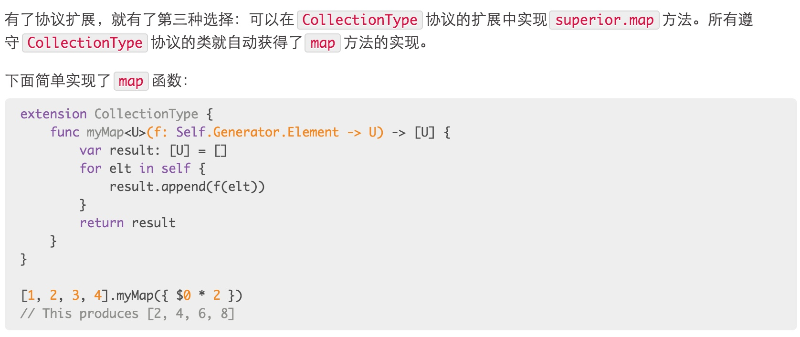
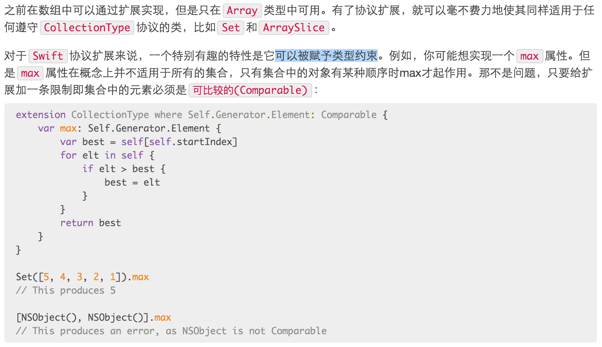
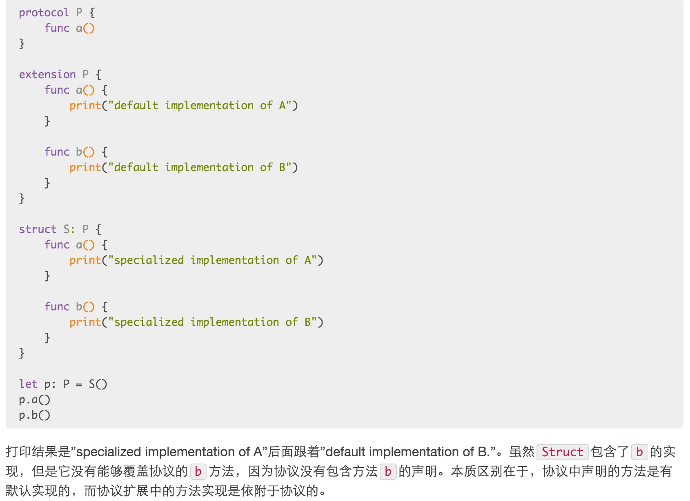
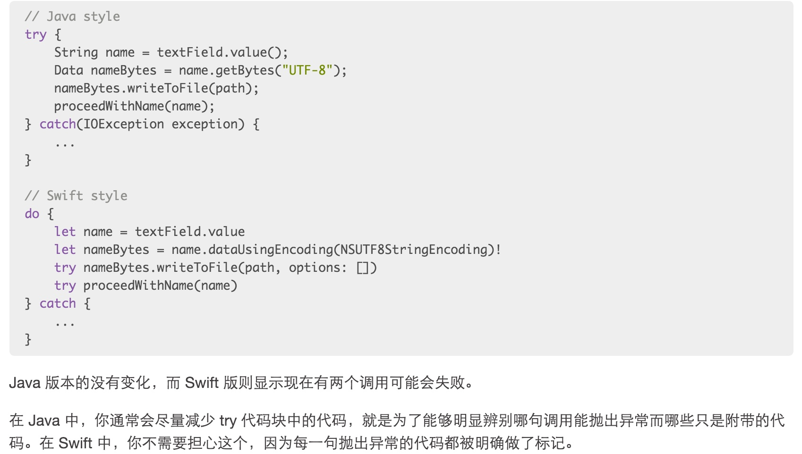
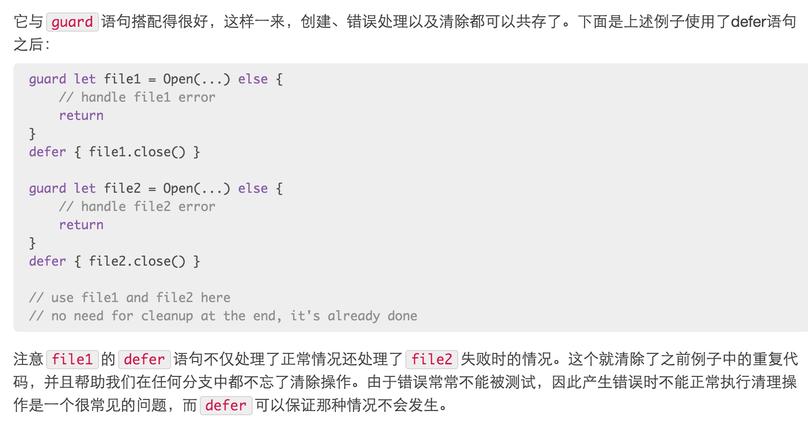

##**1、函数指针：桥接C语言的指针**

Swift 2 中CFunctionPointer的神秘世界即将结束，Swift 中的函数类型已经有了许多变种。任何 Swift 函数类型都可以选择性地通过@convention标识符来进行注解，以此说明函数类型。默认的标注是swift，表示这是一个正常的 Swift 函数。标注为block则说明这是 OC 中的block类型。这些一直都是自动桥接的，但是现在书写方式更加明确。最后，c标注表明这是一个 C 语言函数指针。通过@convention(c)标注的函数类型在多数情况下表现正常，所以你可以像往常那样调用并传递他们。

##**2、协议扩展**

允许协议包含方法的实现：

可以被赋予类型约束：

特性确定协议扩展方法是否可以被动态调度：

##**3、错误处理**

JAVA与Swift的对比

对比发现，Swift在处理异常时候，每一句觉得可能跑出异常语句前面加try可以区分那句话出了异常

##**4、Defer语句：相当于finally**
defer语句与很多其他语言中的finally语句很像，不过它不需要与try语句绑定在一起，你可以把它放在任何你想放的位置。如果你写了defer{…}，那么那个代码块中的代码就会在控制离开当前函数的范围时执行，无论函数最后是运行到了结尾，还是遇到了return语句，或者是抛出了错误。

---

<http://swift.gg/2015/09/01/friday-qa-2015-06-19-the-best-of-whats-new-in-swift/>