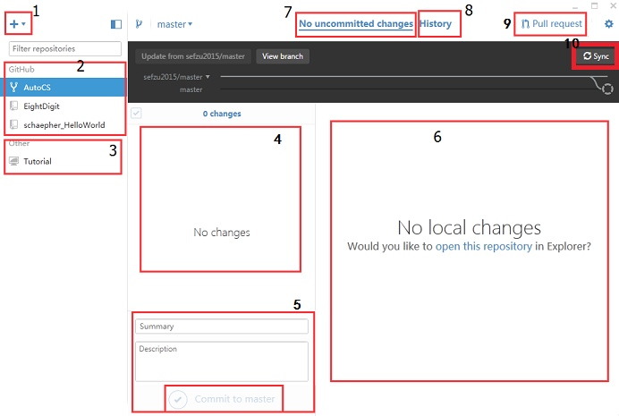

主要界面介绍
======

#### 1\. 这是新建功能，里面有:

> * Add 添加已创建的本地代码库
> 
>   > **注意！**如果在Create之前直接导入一个代码库（本地文件夹），会提示create a repository，点击进入Create。不用更改，直接点击下面的Create repository。
> > 
> >   > * 这时可能会自动帮你添加到Other部分（即上图的3）。
> > >   * 也可能没有任何变化，如果出现这种情况，请再次点击Add选项。你会发现点击Add repository也没用。这时将Local path位置的路径最后一个字母删掉，接着补回来，这样就可以成功Add了。（至于为什么要这么麻烦，我也不清楚，这个方法是我试出来的，如果你有其他更好的方法，分享一下吧）
> * Create 创建新的本地代码库
> * Clone 从GitHub上下载已有的代码库

#### 2\. 这里是已经与GitHub同步的代码库。

#### 3\. 这里是本地的代码库。里面有：

> * 没有提交到GitHub的代码库
> * 更改后未同步的代码库

#### 4\. 如果当前本地代码库有更改，会将更改的文件显示在这里。这里只是缓存。

#### 5\. 如果想提交缓存里的修改修改到本地代码库，需要在这里填写修改摘要（Summary）和详细描述（Description）。然后点击Commit to master，提交到本地代码库。

#### 6\. 如果按照上面的步骤提交到本地代码库，则可以看到那些文件都移动到这里了。此时提交到本地代码库完成。但是还需要将其同步到GitHub上面。

#### 7\. 上面4-6都是在这里的红框选项卡内。这里表示最新情况。

#### 8\. 与上面7不同的是，这里表示提交历史。也可以通过选择下面的master上的圈圈来查看历史提交。

#### 9\. 请求合并。如果你从其他人的GitHub上Fork代码库到你的GitHub并进行修改，又希望其他人将你的代码与他的合并，可以提交请求。如果审核通过，那么你成为这个项目的贡献者之一。

#### 10\. 与上面9不同的是：这里将你的代码与你所参与的项目（有写权限）进行同步（Sync）。如果是是第一次提交代码库，这里显示的是Publish。

### 操作部分，以Helloworld为例：

* 如果先在GitHub中创建好了代码库，那么先用Clone功能，将代码库Clone到本地。此时会将其显示在上图的2中。
* 找到该代码库的本地位置。右键-》Open in Explorer。
* 把用Android Studio或其他IDE创建的Helloworld项目移动到这个文件夹内。
* 在上图7，可以看到发生了变化。接着按照上面5-》6-》10，将项目同步到GitHub上。

分支

===

* 左边表示新建一个分支（branch），从当前的master中另外分出一个支线。
* 右边可以切换分支

参考：<http://www.cnblogs.com/schaepher/p/4823181.html>