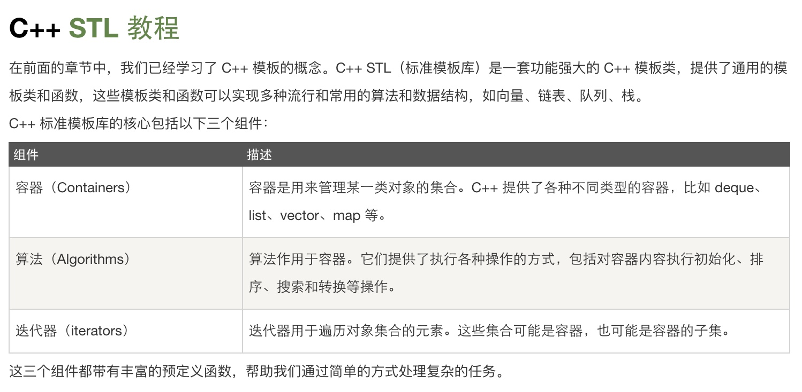

一、Vector 簡介

Vector是C++標準程式庫中的一個類，可視為會自動擴展容量的陣列，是C++標準程式庫中的眾多容器（container）之一，以循序(Sequential)的方式維護變數集合，使用前預先#include "vector" 即可。

**vector的特色：**
1、支援隨機存取
2、集合尾端增刪元素很快 : O(1)
3、集合中間增刪元素比較費時 : O(n)
4、以模板(泛型)方式實現，可以儲存任意類型的變數，包括使用者自定義的資料型態。
5、有一些容器提供 stable iterator 保證，很不幸的 vector 不保證。因此存在一些可能造成vector iterator 失效的操作。

二、成員函式概觀
1、vector 類別是以容器模式為基準設計的，也就是說，基本上它有 begin(), end(), size(), max_size(), empty(), swap()  這幾個方法。

**存取元素的用法：**
1、vec[i] - 存取索引值為 i 的元素參照。
2、vec.at(i) - 存取索引值為 i 的元素的參照，
3、vec.front() - 回傳 vector 第一個元素的參照。
4、vec.back() - 回傳 vector 最尾元素的參照。

警告:少用 operator[]，因為可能會 Segmentation Fault。以 at() 存取會做陣列邊界檢查，如果存取越界將會拋出一個例外，這是與operator[]的唯一差異。

**新增或移除元素的用法：**
1、vec.push_back() - 新增元素至 vector 的尾端，必要時會進行記憶體配置。
2、vec.pop_back() - 刪除 vector 最尾端的元素。
3、vec.insert() - 插入一個或多個元素至 vector 內的任意位置。
4、vec.erase() - 刪除 vector 中一個或多個元素。
5、vec.clear() - 清空所有元素。

警告:少依賴 push_back() 的自動記憶體配置，不是不要用push_back，是不要讓push_back自己判定記憶體需求，能自己要記憶體的就自己要，善用 reserve()、resize() 或 constructor 引數。

**取得長度/容量的用法：**
1、vec.size() - 取得 vector 目前持有的元素個數。
2、vec.empty() - 如果 vector 內部為空，則傳回 true 值。
3、vec.capacity() - 取得 vector 目前可容納的最大元素個數。這個方法與記憶體的配置有關，它通常只會增加，不會因為元素被刪減而隨之減少。

**重新配置／重設長度：**
1、vec.reserve() - 如有必要，可改變 vector 的容量大小（配置更多的記憶體）。在眾多的 STL 實做，容量只能增加，不可以減少。
2、vec.resize() - 改變 vector 目前持有的元素個數。

reserve() 的目的是擴大容量。做完時，vector 的長度不變，capacity 只會長大不會縮小，資料所在位置可能會移動(因為會重配空間)。因為 vector 一開始是空的，立刻預留顯然比填了資料後才預留省了拷資料的時間。
* 重配空間 : 配置新空間、拷資料、歸還舊空間、更新陣列位置。

resize() 的目的是改變 vector 的長度。做完時，vector 的長度會改變為指定的大小，capacity 則視需要調整，確保不小於 size，資料所在位置可能會移動。如果變小就擦掉尾巴的資料，如果變大就補零。補零如果會超過容量，會做重配空間的動作。

**疊代 (Iterator)：**
1、vec.begin() - 回傳一個Iterator，它指向 vector 第一個元素。
2、vec.end() - 回傳一個Iterator，它指向 vector 最尾端元素的下一個位置（請注意：它不是最末元素）。
3、vec.rbegin() - 回傳一個反向Iterator，它指向 vector 最尾端元素的。
4、vec.rend() - 回傳一個Iterator，它指向 vector 的第一個元素。

**容量 (capacity) 和長度 (size)：**
每個 vector 都有兩個重要的數字：容量 (capacity) 和長度 (size) 。
容量 (capacity) : 是這個 vector  擁有的空間。
長度 (size) : 是實際儲存了元素的空間大小。capacity 不小於 size 是個不變條件。

三、常用的vector程式寫法
1. 尋訪

//1. 使用足標運算子 function member - at
for(int i=0; i<v.size(); i++) cout << v[i] << " ";
for(int i=0; i<v.size(); i++) cout << v.at(i) << " ";

//2. 使用 iterator
vector<int>::iterator it_i;
for(it_i=ff.begin(); it_i!=ff.end(); ++it_i) cout << *it_i << " "; 

2. Construction and Assignment

int array[] = {0,1,2,3,4};
vector v(10,0); // {0,0,0,0,0,0,0,0,0,0}
vector v1;
vector v3(v.begin(), v.end())
v1.assign(10, 0); // v1 設 10 個 0
v1.assign(v.begin(), v.end()); // v1 複制 v
v1.assign(v.begin(), v.begin()+5); // 複製 v 前5個元素到 v1
v1.assign(array, array+5); // 複製 array 前5個元素到 v1

3. 用C++的Vector產生動態二維陣列

vector<int> row;
row.assign(n,0);//配置一個row的大小
vector< vector<int> > array_2D;
array_2D.assign(n,row);//配置2維

4. 使用者自定義的資料型態

class NODE
{
    public:
        char symbol;
        int  count;  
};

int main() 
{   
 NODE temp;
 vector<NODE> gem_list;
 
 temp.symbol = 'a';
 temp.count = 0;
 gem_list.push_back(temp);
 
 // .. 經過幾次push_back
 
 for(int i=0; i<gem_list.size(); i++)
 cout<<gem_list[i].symbol<<" "<<gem_list[i].count<<endl;
 
    return 0;
}

警告:優先使用vectors 和iterators 取代低階的array 和pointer
Pointers 和Arrays 對於某些低階任務可能有存在的必要，但我們應該盡量避免使用它們，因為他們容易出錯又很難除錯。一般而言應該優先使用程式庫提供的抽象事物而非語言內建的arrays 和pointers，這一忠告在「多用strings，少用C-Style 字串（亦即以null結尾之字元array）」這件事上尤其合適。
現代化C++程式不該再使用C-Style字串，C++程式應該總是優先使用vectors 和iterators 取代低階的array 和pointer。

<http://net.pku.edu.cn/~yhf/UsingSTL.htm>

<http://www.runoob.com/cplusplus/cpp-stl-tutorial.html>

<http://mropengate.blogspot.jp/2015/07/cc-vector-stl.html>