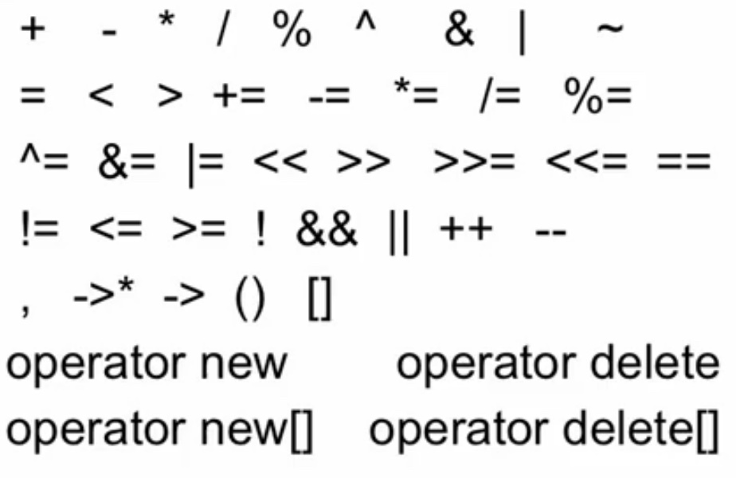
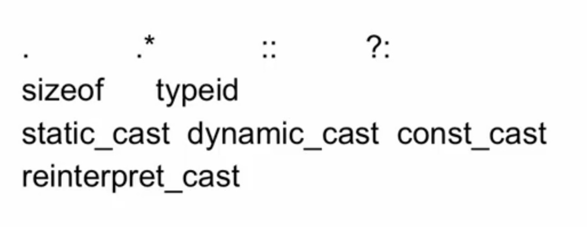
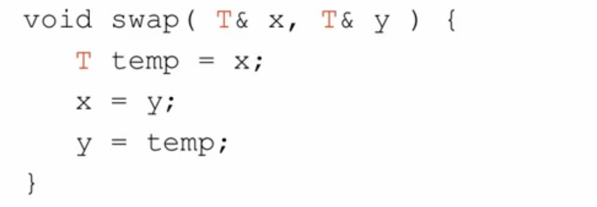
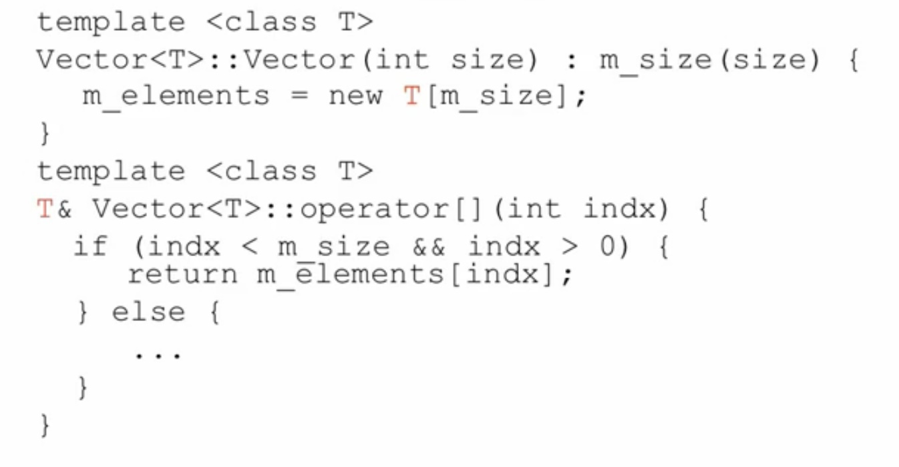
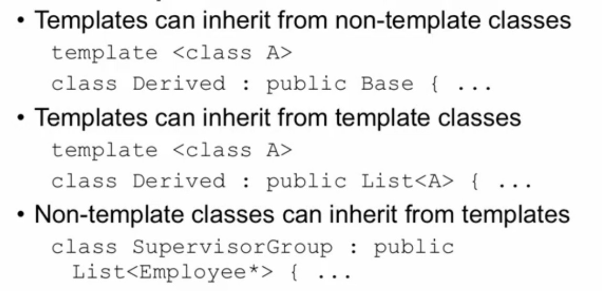
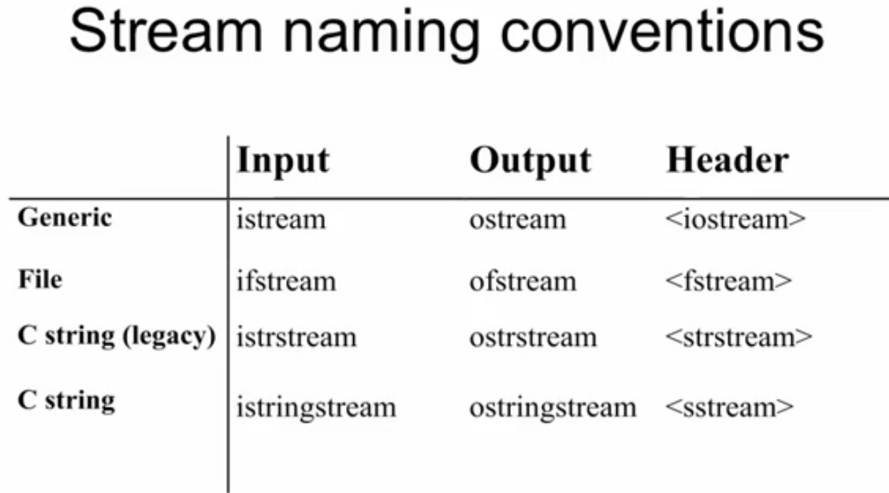
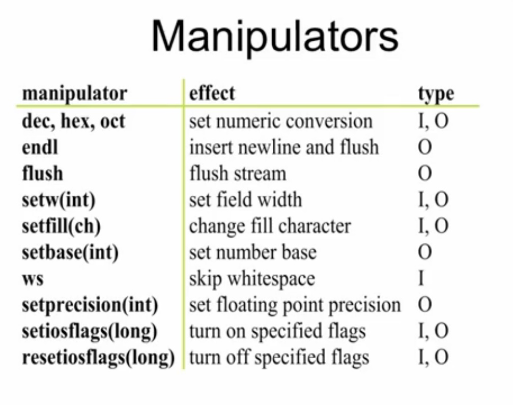
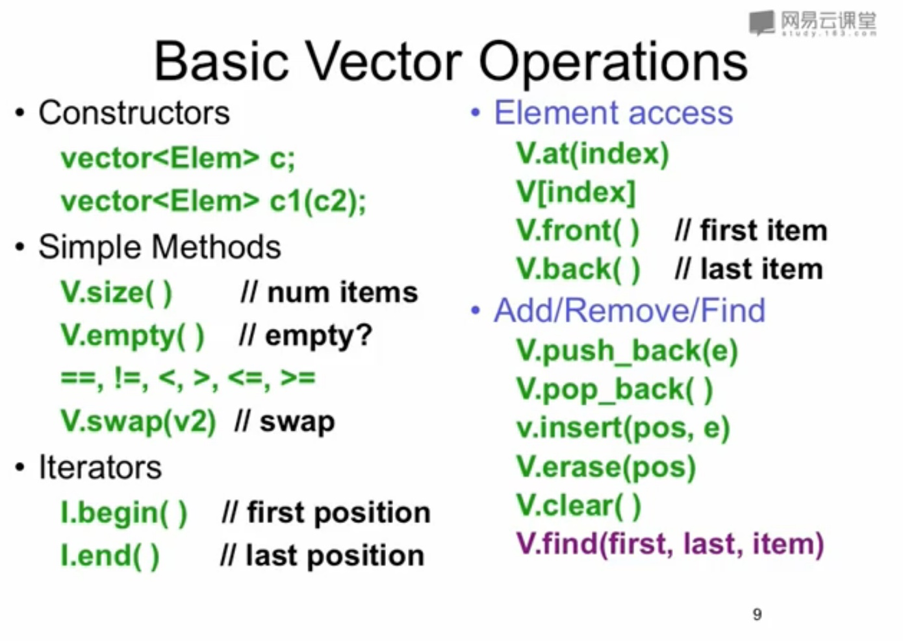
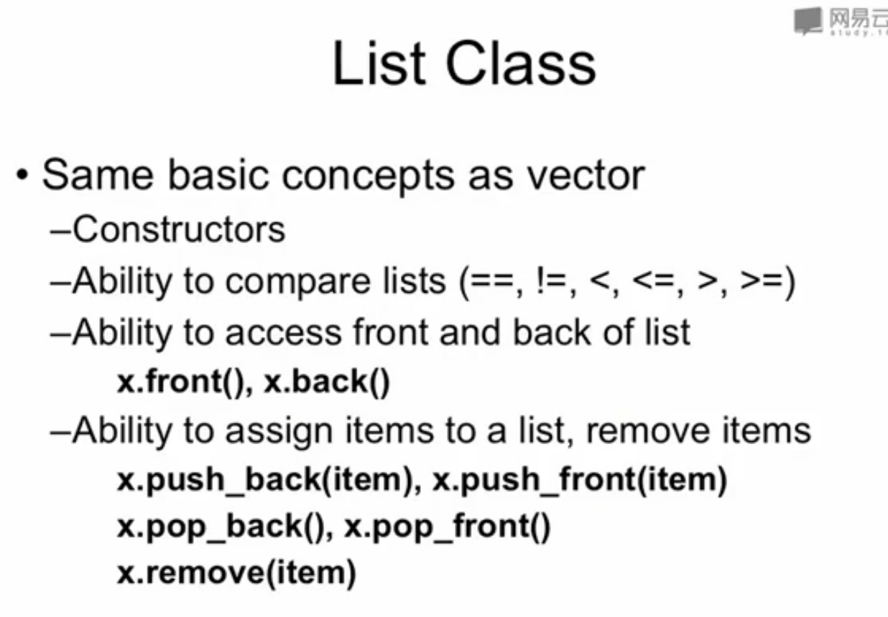

1、使用初始化链表初始化变量，不要使用赋值的方式，因为赋值需要另外用构造函数。

```js
A（）：p(0){}
//相当于 
A(){p = 0}

```

A是B的父类，那么初始化A的构造函数必须放在B的初始化链表内。先调用A的构造再调用B的 构造，先调用B的析构，再调用A的析构。

```js
class B:public A{
public:
B():A(10){...}
}
```

2、把数据放在类的private内，把要给子类用的函数放在protect内，把给子类和外部main等用的放在public内。

3、子类中含有和父类相同的函数，则会隐藏父类所有名字相同函数

4、默认参数只能写在.h文件中，并且.cpp文件中不能重复赋值。一般情况不要使用默认参数。

5、inline

（1）函数前加inline直接编译嵌入代码。可以减少函数调用时内部的栈操作提高程序性能。.cpp.h都要写inline才能编译连接。默认参数只能在.h里面写。

（2）因为编译原因 inline函数是个声明 其只能放.h中，实现也放在.h中，用空间换时间。

（3）如果 inline函数很复杂包含循环递归等，必须用堆栈，则不用inline。

（4）写在.h中直接实现的就是inline函数，也就是内联函数。如果函数只有两三行或者会频繁调用则用inline

6、const

（1）const 变量赋值后不能改变值，const 编译时候必须知道值大小，所以不能外部输入，extern也不行。

（2）extern const 在某地方定义的全局变量

（3）使用const 指针而不是用数组可以减少空间使用并且防止改变const值。

（4）在函数后面加const 表示不去修改任何变量。

（5）在函数前面加const表示函数返回值不能改变。在.h和.cpp要重复写明。

（6）void f()和void f()const可以构成override关系

（7）const 一个类 成员变量必须初始化

7、&

（1）&必须被初始化

（2）const int& z=x 表示不能通过改变Z去改变X的值，只能改X的值&是由\*实现的。

（3）引用由指针实现，使用引用是为了使代码更清晰。

（4）并且是const的指针没有&数组&\*p是不合法的，因为&是const取不到地址

8、向上造型：子类当父类用

9、多态性

（1）父类中使用virtual定义函数，将子类的同名函数与父类函数联系。实现动态绑定。

（2）C++是特殊OOP语言，别的语言都是默认动态，C++默认静态，为了个效率。

（3）静态使用时候，指针调用同名函数会调用父类函数，因为没有virtual父类不知道子类会改写。动态使用的时候，有virtual，所以会调用子类的同名函数。一个类中存在虚函数，实例化后会有vtable，存放指针，指向自己子类函数的同名虚函数，因为调用的时候会直接调用子类函数，不会调用父类函数

10、拷贝构造函数

（1）拷贝构造（自动给）：T：：（const T&）如果存在一个构造函数，参数为对象，那么在创建一个类的时候可以使用赋值的方式传入参数。

（2）这是成员对成员的拷贝不是字节对字节的拷贝。拷贝构造中用（）传参数与用=传一样，因为有默认的拷贝构造函数带有参数。

（3）在拷贝构造中，指针指向同一个地方，为了在析构的时候不会析构两次需要用cstring库。尽量使用string不用char\*除非是做二进制的事情。

（4）任何一个类必须写三个函数：默认构造函数，虚析构函数，拷贝函数。如果不希望被拷贝可以把拷贝构造函数设置为私有的

11、static

（1）static表示持久存储和全局变量。

（2）static的变量无论写在哪里都是全局变量并且一定要有个cpp存放。

（3）初始化列表只能初始化非静态变量。如果是private的静态成员变量，就算在外部定义了静态成员变量，也不能访问。

（4）静态的函数或成员变量在建立这个类前就能通过：：访问。因为没有this所以不能通过this访问类中的非静态数据

12、运算符重载

（1）可重载运算符罗列



（2）不可重载运算符



（3）关键字：operator \*(…)

（4）重载规则

1）单目运算符应该做成成员函数

2）=（）[] -\>\* -\>必须做成成员函数

3）所有其他二元运算符都做成非成员函数，即全局函数

（5）原型

1）const T operatorX(const T &I,const T&r) const————+-\*/^&|~

2）bool operatorX(const T &I,const T&r) const————! && || \< \<= == \>= \>

3）T& T::opertatpr[](int index)————[]

（6）关键字：explicit

表示不能强制类型转换

（7）X::oprator T() const：把X对象转换成T

假如T（X）表示1）X类内有操作符重载函数T可以把X转成T，2）X内有构造函数可以把X转成T 3）如果以上都存在加关键字explicit强行去掉一个使得不能做类型转换

13、模板

（1）函数模板

template \<class T\>



类模板里面的每一个函数都是函数模板，并且类名中也要写明\<T\>



可以有其他类型的变量

template \<class T，int bounds=100\>

模板和继承：

 

14、异常

（1）C++内存管理：堆栈（本地变量）、堆（new出来的）、全局数据区（全局变量，静态本地变量，静态成员变量）

（2）try,catch(...),throw：catch(…)表示捕捉所有异常，throw一直抛出沿着调用的链直到遇到try，进如catch处理异常。

（3）try{ }

catch(somType e){}

catch(somType e){}

catch(somType e){}

…..

（4）void abc(int a):throw(error){….}只能抛出throw中的error

15、流



（１）输入

1）cin.get()

2）get(char\* buf,int limit,char delim=‘\\n')

3）getline(char\* buf,int limit,char delim=‘\\n’)

4）ignore(int limit=1,int delim=EOF)

5）cin.gcount:返回刚才读到了多少个东西

6）cin.putback(char):读一个放回去

7）cin.peek():不读出来，偷窥字符是什么

（２）输出

输出时可以设定输出的样式，比如保留小数位数

cout\<\<setprecision(2)\<\<1.2222



16、STL(标准模板库)

（1）a pair class

（2）容器

vector:

deque:

list:



sets and maps

（3）基本算法

（4）枚举器