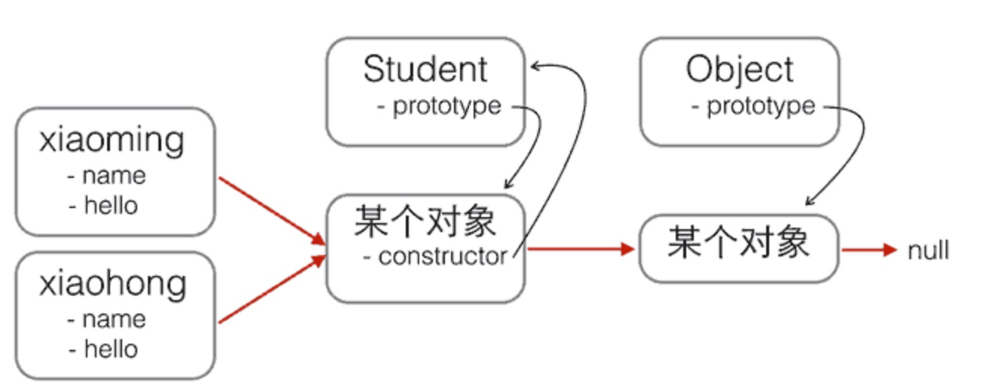
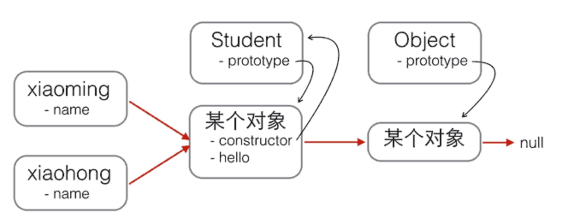

**创建对象：**

JavaScript不区分类和实例的概念，而是通过原型（prototype）来实现面向对象编程。JavaScript的原型链和Java的Class区别就在，它没有“Class”的概念，所有对象都是实例，所谓继承关系不过是把一个对象的原型指向另一个对象而已。在编写JavaScript代码时，不要直接用`obj.__proto__`去改变一个对象的原型，并且，低版本的IE也无法使用`__proto__`。`Object.create()`方法可以传入一个原型对象，并创建一个基于该原型的新对象，但是新对象什么属性都没有，因此，我们可以编写一个函数来创建`xiaoming`：

```coffee
// 原型对象:
var Student = {
    name: 'Robot',
    height: 1.2,
    run: function () {
        console.log(this.name + ' is running...');
    }
};

function createStudent(name) {
    // 基于Student原型创建一个新对象:
    var s = Object.create(Student);
    // 初始化新对象:
    s.name = name;
    return s;
}

var xiaoming = createStudent('小明');
xiaoming.run(); // 小明 is running...
xiaoming.__proto__ === Student; // true

```

构造函数：



```
xiaoming ----> Student.prototype ----> Object.prototype ----> null
```

```coffee
function Student(name) {
    this.name = name;
    this.hello = function () {
        alert('Hello, ' + this.name + '!');
    }
}

var xiaoming = new Student('小明');
xiaoming.name; // '小明'
xiaoming.hello(); // Hello, 小明!
```



```
function Student(name) {
    this.name = name;
}

Student.prototype.hello = function () {
    alert('Hello, ' + this.name + '!');
}
```

为了区分普通函数和构造函数，按照约定，构造函数首字母应当大写，而普通函数首字母应当小写，这样，一些语法检查工具如[jslint](http://www.jslint.com/)将可以帮你检测到漏写的`new`。我们还可以编写一个`createStudent()`函数，在内部封装所有的`new`操作。

```coffee
function Student(props) {
    this.name = props.name || '匿名'; // 默认值为'匿名'
    this.grade = props.grade || 1; // 默认值为1
}

Student.prototype.hello = function () {
    alert('Hello, ' + this.name + '!');
};

function createStudent(props) {
    return new Student(props || {})//不用每次都new，还能传参
}
```

**原型继承：**JavaScript由于采用原型继承，我们无法直接扩展一个Class，因为根本不存在Class这种类型。

```coffee
function PrimaryStudent(props) {
    // 调用Student构造函数，绑定this变量:
    Student.call(this, props);
    this.grade = props.grade || 1;
}
```

调用了`Student`构造函数不等于继承了`Student`，`PrimaryStudent`创建的对象的原型是：

```
new PrimaryStudent() ----> PrimaryStudent.prototype ----> Object.prototype ----> null
```

必须想办法把原型链修改为：

```
new PrimaryStudent() ----> PrimaryStudent.prototype ----> Student.prototype ----> Object.prototype ----> null
```

我们必须借助一个中间对象来实现正确的原型链，这个中间对象的原型要指向`Student.prototype`。为了实现这一点，参考道爷（就是发明JSON的那个道格拉斯）的代码，中间对象可以用一个空函数`F`来实现

```coffee
// PrimaryStudent构造函数:
function PrimaryStudent(props) {
    Student.call(this, props);
    this.grade = props.grade || 1;
}


function inherits(Child, Parent) {
    var F = function () {};// 空函数F:
    F.prototype = Parent.prototype;// 把F的原型指向Student.prototype:
    Child.prototype = new F();// 把PrimaryStudent的原型指向一个新的F对象，F对象的原型正好指向Student.prototype:
    Child.prototype.constructor = Child;// 把PrimaryStudent原型的构造函数修复为PrimaryStudent:
}

// 实现原型继承链:
inherits(PrimaryStudent, Student);

// 继续在PrimaryStudent原型（就是new F()对象）上定义方法：
PrimaryStudent.prototype.getGrade = function () {
    return this.grade;
};

// 创建xiaoming:
var xiaoming = new PrimaryStudent({
    name: '小明',
    grade: 2
});
xiaoming.name; // '小明'
xiaoming.grade; // 2

// 验证原型:
xiaoming.__proto__ === PrimaryStudent.prototype; // true
xiaoming.__proto__.__proto__ === Student.prototype; // true

// 验证继承关系:
xiaoming instanceof PrimaryStudent; // true
xiaoming instanceof Student; // true
```

JavaScript的原型继承实现方式就是：

1. 定义新的构造函数，并在内部用`call()`调用希望“继承”的构造函数，并绑定`this`；
2. 借助中间函数`F`实现原型链继承，最好通过封装的`inherits`函数完成；
3. 继续在新的构造函数的原型上定义新方法。

**class继承：**

新的关键字`class`从ES6开始正式被引入到JavaScript中。`class`的目的就是让定义类更简单。

```coffee
class Student {
    constructor(name) {
        this.name = name;
    }

    hello() {
        alert('Hello, ' + this.name + '!');
    }
}
var xiaoming = new Student('小明');
xiaoming.hello();
```

```coffee
class PrimaryStudent extends Student {
    constructor(name, grade) {
        super(name); // 记得用super调用父类的构造方法!
        this.grade = grade;
    }

    myGrade() {
        alert('I am at grade ' + this.grade);
    }
}
```

