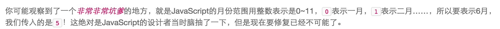

总结一下，有这么几条规则需要遵守：

* 不要使用`new Number()`、`new Boolean()`、`new String()`创建包装对象；
* 用`parseInt()`或`parseFloat()`来转换任意类型到`number`；
* 用`String()`来转换任意类型到`string`，或者直接调用某个对象的`toString()`方法；
* 通常不必把任意类型转换为`boolean`再判断，因为可以直接写`if (myVar) {...}`；
* `typeof`操作符可以判断出`number`、`boolean`、`string`、`function`和`undefined`；
* 判断`Array`要使用`Array.isArray(arr)`；
* 判断`null`请使用`myVar === null`；
* 判断某个全局变量是否存在用`typeof window.myVar === 'undefined'`；
* 函数内部判断某个变量是否存在用`typeof myVar === 'undefined'`。

Date:

RegEx:

正则表达式是一种用来匹配字符串的强有力的武器。它的设计思想是用一种描述性的语言来给字符串定义一个规则，凡是符合规则的字符串，我们就认为它“匹配”了，否则，该字符串就是不合法的。

JSON:

1.序列化（把JavaScript对象变成JSON）

//首先定义一个对象xiaoming var xiaoming{ name:'小明'， age:13, gender:true, height:1.40, grade: null, 'middle-school': '\\"W3C\\" Middle School', skills: ['JavaScript', 'Java', 'Python', 'Lisp']

}; //然后序列化该对象 JSON.stringify(xiaoming);

 //产生整齐一点的JSON字符串可以这样写： JSON.stringify(xiaoming,null,' '); 第二个参数可以用一个数组/函数代替。以此产生用户所需的JSON字符串。

2.反序列化，就是把JSON格式的字符串变成一个JS对象。

JSON.parse('{"name":"小明","age"：14}',function(key,value){ if(key==='name'){ return value+'同学'; } return value; });