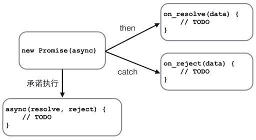

**浏览器对象：**

`window`对象有`innerWidth`和`innerHeight`属性，可以获取浏览器窗口的内部宽度和高度。内部宽高是指除去菜单栏、工具栏、边框等占位元素后，用于显示网页的净宽高。对应的，还有一个`outerWidth`和`outerHeight`属性，可以获取浏览器窗口的整个宽高。

`navigator`对象表示浏览器的信息，最常用的属性包括：

* navigator.appName：浏览器名称；
* navigator.appVersion：浏览器版本；
* navigator.language：浏览器设置的语言；
* navigator.platform：操作系统类型；
* navigator.userAgent：浏览器设定的`User-Agent`字符串。

`screen`对象表示屏幕的信息，常用的属性有：

* screen.width：屏幕宽度，以像素为单位；
* screen.height：屏幕高度，以像素为单位；
* screen.colorDepth：返回颜色位数，如8、16、24。

`location`对象表示当前页面的URL信息。可以用`location.href`获取。要加载一个新页面，可以调用`location.assign()`。如果要重新加载当前页面，调用`location.reload()`方法非常方便。要获得URL各个部分的值，可以这么写：

```
location.protocol; // 'http'
location.host; // 'www.example.com'
location.port; // '8080'
location.pathname; // '/path/index.html'
location.search; // '?a=1&b=2'
location.hash; // ‘TOP'
```

`document`对象表示当前页面。由于HTML在浏览器中以DOM形式表示为树形结构，`document`对象就是整个DOM树的根节点。

`document`的`title`属性是从HTML文档中的`<title>xxx</title>`读取的，但是可以动态改变：

用`document`对象提供的`getElementById()`和`getElementsByTagName()`可以按ID获得一个DOM节点和按Tag名称获得一组DOM节点：

JavaScript可以通过`document.cookie`读取到当前页面的Cookie：


**DOM：**

由于HTML文档被浏览器解析后就是一棵DOM树，要改变HTML的结构，就需要通过JavaScript来操作DOM。在操作一个DOM节点前，我们需要通过各种方式先拿到这个DOM节点。最常用的方法是`document.getElementById()`和`document.getElementsByTagName()`，以及CSS选择器`document.getElementsByClassName()`。

```coffee
// 返回ID为'test'的节点：
var test = document.getElementById('test');

// 先定位ID为'test-table'的节点，再返回其内部所有tr节点：
var trs = document.getElementById('test-table').getElementsByTagName('tr');

// 先定位ID为'test-div'的节点，再返回其内部所有class包含red的节点：
var reds = document.getElementById('test-div').getElementsByClassName('red');

// 获取节点test下的所有直属子节点:
var cs = test.children;

// 获取节点test下第一个、最后一个子节点：
var first = test.firstElementChild;
var last = test.lastElementChild;
```

第二种方法是使用`querySelector()`和`querySelectorAll()`，需要了解selector语法，然后使用条件来获取节点，更加方便。注意：低版本的IE\<8不支持`querySelector`和`querySelectorAll`。IE8仅有限支持。

```coffee
// 通过querySelector获取ID为q1的节点：
var q1 = document.querySelector('#q1');

// 通过querySelectorAll获取q1节点内的符合条件的所有节点：
var ps = q1.querySelectorAll('div.highlighted > p');
```

更新DOM：

可以直接修改节点的文本，方法有两种：

一种是修改`innerHTML`属性，这个方式非常强大，不但可以修改一个DOM节点的文本内容，还可以直接通过HTML片段修改DOM节点内部的子树：

用`innerHTML`时要注意，是否需要写入HTML。如果写入的字符串是通过网络拿到了，要注意对字符编码来避免XSS攻击。

第二种是修改`innerText`或`textContent`属性，这样可以自动对字符串进行HTML编码，保证无法设置任何HTML标签：者的区别在于读取属性时，`innerText`不返回隐藏元素的文本，而`textContent`返回所有文本。另外注意IE\<9不支持`textContent`。

修改CSS也是经常需要的操作。DOM节点的`style`属性对应所有的CSS，可以直接获取或设置。

插入DOM：

如果这个DOM节点是空的，例如，`<div></div>`，那么，直接使用`innerHTML = '<span>child</span>'`就可以修改DOM节点的内容，相当于“插入”了新的DOM节点。

如果这个DOM节点不是空的，那就不能这么做，因为`innerHTML`会直接替换掉原来的所有子节点。

有两个办法可以插入新的节点。一个是使用`appendChild`，把一个子节点添加到父节点的最后一个子节点。

因为我们插入的`js`节点已经存在于当前的文档树，因此这个节点首先会从原先的位置删除，再插入到新的位置。

更多的时候我们会从零创建一个新的节点，然后插入到指定位置

如果我们要把子节点插入到指定的位置怎么办？可以使用`parentElement.insertBefore(newElement, referenceElement);`，子节点会插入到`referenceElement`之前。

删除DOM：

要删除一个节点，首先要获得该节点本身以及它的父节点，然后，调用父节点的`removeChild`把自己删掉：

```coffee
// 拿到待删除节点:
var self = document.getElementById('to-be-removed');
// 拿到父节点:
var parent = self.parentElement;
// 删除:
var removed = parent.removeChild(self);
removed === self; // true
```


**操作表单：**

HTML表单的输入控件主要有以下几种：

* 文本框，对应的`<input type="text">`，用于输入文本；
* 口令框，对应的`<input type="password">`，用于输入口令；
* 单选框，对应的`<input type="radio">`，用于选择一项；
* 复选框，对应的`<input type="checkbox">`，用于选择多项；
* 下拉框，对应的`<select>`，用于选择一项；
* 隐藏文本，对应的`<input type="hidden">`，用户不可见，但表单提交时会把隐藏文本发送到服务器。

提交表单：

JavaScript可以以两种方式来处理表单的提交（AJAX方式在后面章节介绍）。

方式一是通过`<form>`元素的`submit()`方法提交一个表单，例如，响应一个`<button>`的`click`事件，在JavaScript代码中提交表单。这种方式的缺点是扰乱了浏览器对form的正常提交。浏览器默认点击`<button type="submit">`时提交表单，或者用户在最后一个输入框按回车键。

```coffee
<!-- HTML -->
<form id="test-form">
    <input type="text" name="test">
    <button type="button" onclick="doSubmitForm()">Submit</button>
</form>

<script>
function doSubmitForm() {
    var form = document.getElementById('test-form');
    // 可以在此修改form的input...
    // 提交form:
    form.submit();
}
</script>
```

第二种方式是响应`<form>`本身的`onsubmit`事件，在提交form时作修改，注意要`return true`来告诉浏览器继续提交，如果`return false`，浏览器将不会继续提交form，这种情况通常对应用户输入有误，提示用户错误信息后终止提交form。

```coffee
<!-- HTML -->
<form id="test-form" onsubmit="return checkForm()">
    <input type="text" name="test">
    <button type="submit">Submit</button>
</form>

<script>
function checkForm() {
    var form = document.getElementById('test-form');
    // 可以在此修改form的input...
    // 继续下一步:
    return true;
}
</script>
```

没有`name`属性的`<input>`的数据不会被提交。


**操作文件：**

在HTML表单中，可以上传文件的唯一控件就是`<input type="file">`。

*注意*：当一个表单包含`<input type="file">`时，表单的`enctype`必须指定为`multipart/form-data`，`method`必须指定为`post`，浏览器才能正确编码并以`multipart/form-data`格式发送表单的数据。

出于安全考虑，浏览器只允许用户点击`<input type="file">`来选择本地文件，用JavaScript对`<input type="file">`的`value`赋值是没有任何效果的。当用户选择了上传某个文件后，JavaScript也无法获得该文件的真实路径

File API

```coffee
var
    fileInput = document.getElementById('test-image-file'),
    info = document.getElementById('test-file-info'),
    preview = document.getElementById('test-image-preview');
// 监听change事件:
fileInput.addEventListener('change', function () {
    // 清除背景图片:
    preview.style.backgroundImage = '';
    // 检查文件是否选择:
    if (!fileInput.value) {
        info.innerHTML = '没有选择文件';
        return;
    }
    // 获取File引用:
    var file = fileInput.files[0];
    // 获取File信息:
    info.innerHTML = '文件: ' + file.name + '<br>' +
                     '大小: ' + file.size + '<br>' +
                     '修改: ' + file.lastModifiedDate;
    if (file.type !== 'image/jpeg' && file.type !== 'image/png' && file.type !== 'image/gif') {
        alert('不是有效的图片文件!');
        return;
    }
    // 读取文件:
    var reader = new FileReader();
    reader.onload = function(e) {
        var
            data = e.target.result; // 'data:image/jpeg;base64,/9j/4AAQSk...(base64编码)...'            
        preview.style.backgroundImage = 'url(' + data + ')';
    };
    // 以DataURL的形式读取文件:
    reader.readAsDataURL(file);
});
```


AJAX：

AJAX不是JavaScript的规范，它只是一个哥们“发明”的缩写：Asynchronous JavaScript and XML，意思就是用JavaScript执行异步网络请求。需要注意：AJAX请求是异步执行的，也就是说，要通过回调函数获得响应。

在现代浏览器上写AJAX主要依靠`XMLHttpRequest`对象

```coffee
function success(text) {
    var textarea = document.getElementById('test-response-text');
    textarea.value = text;
}

function fail(code) {
    var textarea = document.getElementById('test-response-text');
    textarea.value = 'Error code: ' + code;
}

var request = new XMLHttpRequest(); // 新建XMLHttpRequest对象

request.onreadystatechange = function () { // 状态发生变化时，函数被回调
    if (request.readyState === 4) { // 成功完成
        // 判断响应结果:
        if (request.status === 200) {
            // 成功，通过responseText拿到响应的文本:
            return success(request.responseText);
        } else {
            // 失败，根据响应码判断失败原因:
            return fail(request.status);
        }
    } else {
        // HTTP请求还在继续...
    }
}

// 发送请求:
request.open('GET', '/api/categories');
request.send();

alert('请求已发送，请等待响应...');

```

通过检测`window`对象是否有`XMLHttpRequest`属性来确定浏览器是否支持标准的`XMLHttpRequest`。注意，*不要*根据浏览器的`navigator.userAgent`来检测浏览器是否支持某个JavaScript特性，一是因为这个字符串本身可以伪造，二是通过IE版本判断JavaScript特性将非常复杂。

当创建了`XMLHttpRequest`对象后，要先设置`onreadystatechange`的回调函数。在回调函数中，通常我们只需通过`readyState === 4`判断请求是否完成，如果已完成，再根据`status === 200`判断是否是一个成功的响应。

`XMLHttpRequest`对象的`open()`方法有3个参数，第一个参数指定是`GET`还是`POST`，第二个参数指定URL地址，第三个参数指定是否使用异步，默认是`true`，所以不用写。

*注意*，千万不要把第三个参数指定为`false`，否则浏览器将停止响应，直到AJAX请求完成。如果这个请求耗时10秒，那么10秒内你会发现浏览器处于“假死”状态。

最后调用`send()`方法才真正发送请求。`GET`请求不需要参数，`POST`请求需要把body部分以字符串或者`FormData`对象传进去。

安全限制：

默认情况下，JavaScript在发送AJAX请求时，URL的域名必须和当前页面完全一致。

那是不是用JavaScript无法请求外域（就是其他网站）的URL了呢？方法还是有的

第三种方式称为JSONP，它有个限制，只能用GET请求，并且要求返回JavaScript。这种方式跨域实际上是利用了浏览器允许跨域引用JavaScript资源：

CORS:如果浏览器支持HTML5，那么就可以一劳永逸地使用新的跨域策略：CORS了。

了解CORS前，我们先搞明白概念：

Origin表示本域，也就是浏览器当前页面的域。当JavaScript向外域（如sina.com）发起请求后，浏览器收到响应后，首先检查`Access-Control-Allow-Origin`是否包含本域，如果是，则此次跨域请求成功，如果不是，则请求失败，JavaScript将无法获取到响应的任何数据。

用一个图来表示就是：


假设本域是`my.com`，外域是`sina.com`，只要响应头`Access-Control-Allow-Origin`为`http://my.com`，或者是`*`，本次请求就可以成功。

可见，跨域能否成功，取决于对方服务器是否愿意给你设置一个正确的`Access-Control-Allow-Origin`，决定权始终在对方手中。

上面这种跨域请求，称之为“简单请求”。简单请求包括GET、HEAD和POST（POST的Content-Type类型 仅限`application/x-www-form-urlencoded`、`multipart/form-data`和`text/plain`），并且不能出现任何自定义头.

对于PUT、DELETE以及其他类型如`application/json`的POST请求，在发送AJAX请求之前，浏览器会先发送一个`OPTIONS`请求（称为preflighted请求）到这个URL上，询问目标服务器是否接受：

```coffee
OPTIONS /path/to/resource HTTP/1.1
Host: bar.com
Origin: http://my.com
Access-Control-Request-Method: POST
```


**
**

#### Promise：

Promise最大的好处是在异步执行的流程中，把执行代码和处理结果的代码清晰地分离了：



Promise还可以做更多的事情，比如，有若干个异步任务，需要先做任务1，如果成功后再做任务2，任何任务失败则不再继续并执行错误处理函数。

```coffee
job1.then(job2).then(job3).catch(handleError);
```

除了串行执行若干异步任务外，Promise还可以并行执行异步任务。

试想一个页面聊天系统，我们需要从两个不同的URL分别获得用户的个人信息和好友列表，这两个任务是可以并行执行的，用`Promise.all()`

```
有些时候，多个异步任务是为了容错。比如，同时向两个URL读取用户的个人信息，只需要获得先返回的结果即可。这种情况下，用`Promise.race()`
```

**Canvas：**

Canvas是HTML5新增的组件，它就像一块幕布，可以用JavaScript在上面绘制各种图表、动画等。

`getContext('2d')`方法让我们拿到一个`CanvasRenderingContext2D`对象，所有的绘图操作都需要通过这个对象完成。

```coffee
var ctx = canvas.getContext('2d');
```

如果需要绘制3D怎么办？HTML5还有一个WebGL规范，允许在Canvas中绘制3D图形：

```coffee
gl = canvas.getContext("webgl");
```

Canvas除了能绘制基本的形状和文本，还可以实现动画、缩放、各种滤镜和像素转换等高级操作。如果要实现非常复杂的操作，考虑以下优化方案：

* 通过创建一个不可见的Canvas来绘图，然后将最终绘制结果复制到页面的可见Canvas中；
* 尽量使用整数坐标而不是浮点数；
* 可以创建多个重叠的Canvas绘制不同的层，而不是在一个Canvas中绘制非常复杂的图；
* 背景图片如果不变可以直接用``标签并放到最底层。

