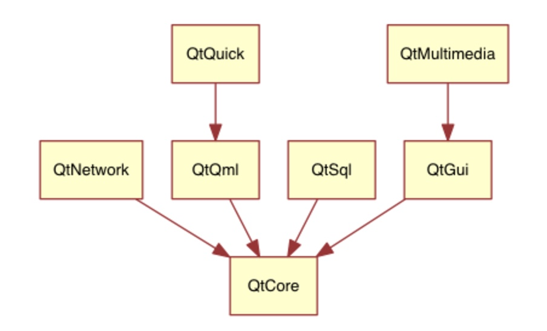

1、 anchors:锚定允许你指定几何对象与父对象或者同级对象之间的位置关系。比如放置我在另一个元素中间（anchors.centerIn:parent）.有左边（left），右边（right），顶部（top），底部（bottom），中央（centerIn），填充（fill），垂直中央（verticalCenter）和水平中央（horizontalCenter）来表示元素之间的关系。

2、命名：对于每个工作的信号，命名方式：on+SignalName
         属性的值发生改变时，命名方式：on+PropertyName+Chagned（如onWidthChanged: print(width)）
 
3、动画：

```js
Image {
    id: root
    ...
    Image {
        id: wheel
        Behavior on rotation {
            NumberAnimation {
                duration: 250
            }
        }
    }
}
```

NumberAnimation:每当旋转角度发生改变时都会使用NumberAnimation来实现250毫秒的旋转动画效果。每一次90度的转变都需要花费250ms。

4、QT构建模块
    Qt5是由大量的模块组成的。一个模块通常情况下是一个库，提供给开发者使用。一些模块是强制性用来支持Qt平台的，它们分成一组叫做Qt基础模块。许多模块是可选的，它们分成一组叫做Qt附加模块。
（1）核心基础模块  
1）Qt Core：核心的非图形类，供其它模块使用。
2）Qt GUI：图形用户界面（GUI）组件的基类，包括OpenGL。
3）Qt Multimedia：音频，视频，电台，摄像头的功能类。
4）Qt Network：简化方便的网络编程的类。
5）Qt QML：QML类与JavaScript语言的支持。
6）Qt Quick：可高度动态构建的自定义应用程序用户界面框架。
7）Qt SQL：集成SQL数据库类。
8）Qt Test：Qt应用程序与库的单元测试类。
9）Qt WebKit：集成WebKit2的基础实现并且提供了新的QML应用程序接口。在附件模块中查看Qt WebKit 10）Widgets可以获取更多的信息。
11）Qt WebKit Widgets：来自Qt4中集成WebKit1的窗口基础类。
12）Qt Widgets：扩展Qt GUI模块的C++窗口类。

基础模块依赖关系图：



（2）附加基础模块  
1）Qt 3D - 一组使3D编程更加方便的应用程序接口和声明。
2）Qt Bluetooth - 在多平台上使用无线蓝牙技术的C++和QML应用程序接口。
3）Qt Contacts - 提供访问联系人与联系人数据库的C++和QML应用程序接口。
4）Qt Location - 提供了定位，地图，导航和位置搜索的C++与QML接口。使用NMEA在后端进行定位。（NMEA缩写，同时也是数据传输标准工业协会，在这里，实际上应为NMEA0183。它是一套定义接收机输出的标准信息，有几种不同的格式，每种都是独立相关的ASCII格式，逗点隔开数据流，数据流长度从30-100字符不等，通常以每秒间隔选择输出，最常用的格式为"GGA"，它包含了定位时间，纬度，经度，高度，定位所用的卫星数，DOP值,差分状态和校正时段等，其他的有速度，跟踪，日期等。NMEA实际上已成为所有的GPS接收机和最通用的数据输出格式，同时它也被用于与GPS接收机接口的大多数的软件包里。）
5）Qt Organizer - 提供了组织事件（任务清单，事件等等）的C++和QML应用程序接口。
6）Qt Publish and SubScribe - Qt发布与订阅
7）Qt Sensors - 访问传感器的QML与C++接口。
8）Qt Service Framework - 允许应用程序读取，操纵和订阅来改变通知信息。
9）Qt System Info - 发布系统相关的信息和功能。
10）Qt Versit - 支持电子名片与日历数据格式（iCalendar）。（iCalendar是“日历数据交换”的标准（RFC  2445）。 此标准有时指的是“iCal”，即苹果公司的出品的一款同名日历软件，这个软件也是此标准的一种实现方式。）
11）Qt Wayland - 只用于Linux系统。包含了Qt合成器应用程序接口（server），和Wayland平台插件（clients）。
12）Qt Feedback - 反馈用户的触摸和声音操作。
13）Qt JSON DB - 对于Qt的一个不使用SQL对象存储。