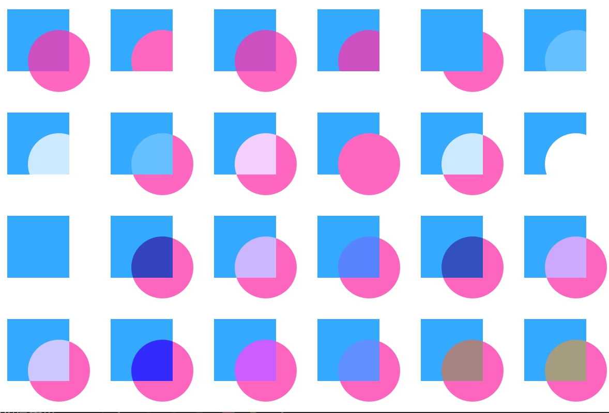

画布元素（canvas element）的基本思想是使用一个2D对象来渲染路径。这个2D对象包括了必要的绘图函数，画布元素（canvas element）充当绘制画布。2D对象支持画笔，填充，渐变，文本和绘制路径创建命令。画布自身提供了典型的二维笛卡尔坐标系统，左上角是（0,0）坐标。Y轴坐标轴向下，X轴坐标轴向右。

```js
import QtQuick 2.0

Canvas {
    id: root
    width: 200; height: 200
    onPaint: {//绘制需要在此事件下完成
        var ctx = getContext("2d")
        ctx.lineWidth = 4
        ctx.strokeStyle = "blue"//画笔样式
        ctx.fillStyle = "steelblue"//填充色
        
        ctx.beginPath()
        ctx.moveTo(50,50)
        ctx.lineTo(150,50)
        ctx.lineTo(150,150)
        ctx.lineTo(50,150)
        ctx.closePath()

        ctx.fill()//只有调用stroke或者fill函数，创建的路径才会绘制
        ctx.stroke()//调用stroke或者fill将会绘制当前的路径，创建的路径是不可重用的，只有绘制状态能够被存储和恢复。
    }
}
//基本步骤：

//装载画笔或者填充模式

//创建绘制路径

//使用画笔或者填充绘制路径
```

<font color="#4590a3" size="2px">注意：通常在你重置了路径后你将会设置一个开始点，所以，在beginPath()这个操作后，你需要使用moveTo来设置开始点。</font>


（1）便捷的接口：在绘制矩形时，而不需要调用stroke或者fill来完成，而是使用接口调用。
（2）渐变：

```js
    onPaint: {
        var ctx = getContext("2d")
        var gradient = ctx.createLinearGradient(100,0,100,200)
        gradient.addColorStop(0, "blue")
        gradient.addColorStop(0.5, "lightsteelblue")
        ctx.fillStyle = gradient
        ctx.fillRect(50,50,100,100)
    }
```

<font color="#4590a3" size="2px">注意：渐变色是在画布坐标下定义的，而不是在绘制路径相对坐标下定义的。画布中没有相对坐标的概念。</font>

（3）阴影：2D对象的路径可以使用阴影增强显示效果。阴影是一个区域的轮廓线使用偏移量，颜色和模糊来实现的。所以你需要指定的属性有：
1）阴影颜色（shadowColor）
2）阴影X轴偏移值（shadowOffsetX）
3）阴影Y轴偏移值（shadowOffsetY）
4）阴影模糊（shadowBlur）
这些参数的定义都使用2D context来定义。2D context是唯一的绘制操作接口。

（4）图片：Component.onCompleted操作来加载图片

```js
  Component.onCompleted: {
        loadImage("assets/ball.png")
    }
```

（5）转换：画布有多种方式来转换坐标系。这些操作非常类似于QML元素的转换。你可以通过缩放（scale），旋转（rotate），translate（移动）来转换坐标系。与QML元素的转换不同的是，转换原点通常就是画布原点。

（6）组合模式：组合允许你绘制一个形状然后与已有的像素点集合混合。画布提供了多种组合模式，使用globalCompositeOperation(mode)来设置。



```js
    property var operation : [
        'source-over', 'source-in', 'source-over',
        'source-atop', 'destination-over', 'destination-in',
        'destination-out', 'destination-atop', 'lighter',
        'copy', 'xor', 'qt-clear', 'qt-destination',
        'qt-multiply', 'qt-screen', 'qt-overlay', 'qt-darken',
        'qt-lighten', 'qt-color-dodge', 'qt-color-burn',
        'qt-hard-light', 'qt-soft-light', 'qt-difference',
        'qt-exclusion'
        ]
```

（7）像素缓冲：
当你使用画布时，你可以检索读取画布上的像素数据，或者操作画布上的像素。读取图像数据使用createImageData(sw,sh)或者getImageData(sx,sy,sw,sh)。这两个函数都会返回一个包含宽度（width），高度（height）和数据（data）的图像数据（ImageData）对象。图像数据包含了一维数组像素数据，使用RGBA格式进行检索。每个数据的数据范围在0到255之间。设置画布的像素数据你可以使用putImageData(imagedata,dx,dy)函数来完成。
另一种检索画布内容的方法是将画布的数据存储进一张图片中。可以使用画布的函数save(path)或者toDataURL(mimeType)来完成，toDataURL(mimeType)会返回一个图片的地址，这个链接可以直接用Image元素来读取。

```js
QT.hsla(色度,饱和度, 明亮, 透明度)
```

（8）画布绘制：画板
（9）HTML5画布移植：在HTML5中，context2D对象可以随意在画布上绘制。在QML中，只能在onPaint操作中绘制。在HTML5中，通常调用setInterval使用计时器触发线段的绘制或者清屏。