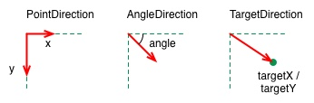

粒子是基于模糊来渲染。它的结果在基于像素下是不可预测的。粒子系统的参数描述了随机模拟的边界。传统的渲染技术实现粒子渲染效果很困难。有一个好消息是你可以使用QML元素与粒子系统交互。同时参数也可以看做是属性，这些参数可以使用传统的动画技术来实现动态效果。

（1）概念：粒子模拟的核心是粒子系统（ParticleSystem），它控制了共享时间线。一个场景下可以有多个粒子系统，每个都有自己独立的时间线。一个粒子使用发射器元素（Emitter）发射，使用粒子画笔（ParticlePainter）实现可视化，它可以是一张图片，一个QML项或者一个着色项（shaderitem）。一个发射器元素（Emitter）也提供向量来控制粒子方向。一个粒子被发送后就再也无法控制。粒子模型提供粒子控制器（Affector），它可以控制已发射粒子的参数。需要导入包import QtQuick.Particles 2.0

组成：
1）粒子系统（ParticleSystem）- 管理发射器之间的共享时间线。
2）发射器（Emitter）- 向系统中发射逻辑粒子。
3）粒子画笔（ParticlePainter）- 实现粒子可视化。
4）方向（Direction）- 已发射粒子的向量空间。
5）粒子组（ParticleGroup）- 每个粒子是一个粒子组的成员。
6）粒子控制器（Affector）- 控制已发射粒子。

（2）粒子参数：

```js
    ImageParticle {
        source: "assets/star.png"
        system: particleSystem
        color: '#FFD700'//颜色变化范围
        colorVariation: 0.2//颜色浮动值
        rotation: 0
        rotationVariation: 45//每秒旋转浮动值
        rotationVelocity: 15//旋转速度
        rotationVelocityVariation: 15//旋转速度浮动值
        entryEffect: ImageParticle.Scale//粒子入场效果
    }
```

（3）粒子方向：
我们已经看到了粒子的旋转，但是我们的粒子需要一个轨迹。轨迹由速度或者粒子随机方向的加速度指定，也可以叫做矢量空间。有多种可用矢量空间用来定义粒子的速度或加速度：
1）角度方向（AngleDirection）- 使用角度的方向变化。



速度控制：

```js
    Emitter{
        id:emitter
        system: particleSystem
        ·······
        velocity: AngleDirection {
            angle: 0
            angleVariation: 15//角度变化范围
            magnitude: 100//指定粒子的速度。它由一个梯度值定义
            magnitudeVariation: 50//速度变化范围
        }
       ········
    }
```

加速度控制：

```js
Emitter {
        ·····
        velocity: AngleDirection {
            angle: -45
            angleVariation: 0
            magnitude: 100
        }
        
        acceleration: AngleDirection {
            angle: 90
            magnitude: 25
        }
    }
```

2）点方向（PointDirection）- 使用x,y组件组成的方向变化。

```js
velocity: PointDirection {
    x: 100
    y: 0
    xVariation: 0
    yVariation: 100/6
}
```

3）目标方向（TargetDirection）- 朝着目标点的方向变化。

```js
velocity: TargetDirection {
    targetX: 100
    targetY: 0
    targetVariation: 100/6//浮动浮动变化
    magnitude: 100
}
```

（4）粒子画笔

* 粒子项（ItemParticle）：基于粒子画笔的代理，粒子项可以将QML元素（不只是图片）项作为粒子发射。你需要制定自己的粒子代理。
* 自定义粒子（CustomParticle）：基于粒子画笔的着色器

对于更多的动态情况，也可以由你自己创建一个子项，让粒子系统来控制它，使用take(item, priority)来完成。粒子系统控制你的粒子就像控制普通的粒子一样。你可以使用give(item)来拿回子项的控制权。你也可以操作子项粒子，甚至可以使用freeze(item)来停止它，使用unfreeze(item)来恢复它。

```js
    ItemParticle {
        id: particle
        system: particleSystem
        delegate: itemDelegate
    }
```

（5）粒子控制

控制器的每个类型使用不同的方法来影响粒子：

* 生命周期（Age）- 修改粒子的生命周期
* 吸引（Attractor）- 吸引粒子朝向指定点
* 摩擦（Friction）- 按当前粒子速度成正比减慢运动
* 重力（Gravity）- 设置一个角度的加速度
* 紊流（Turbulence）- 强制基于噪声图像方式的流动。对粒子应用了一个混乱映射方向力的矢量。
* 漂移（Wander）- 随机变化的轨迹
* 组目标（GroupGoal）- 改变一组粒子群的状态
* 子粒子（SpriteGoal）- 改变一个子粒子的状态

（6）粒子组

默认下，粒子都属于空组（""）。使用GroupGoal控制器可以改变粒子组。使用groups属性来定义粒子的归属。只需要定义一个名字，Qt Quick将会隐式的创建这个分组。

追踪发射器：模拟跟在火箭后的烟雾

```js
TrailEmitter {
    id: smokeEmitter
    system: particleSystem
    emitHeight: 1//指定了围绕跟随在烟雾粒子发射后的粒子
    emitWidth: 4//指定了围绕跟随在烟雾粒子发射后的粒子
    group: 'smoke'
    follow: 'rocket'//跟着rocket
    emitRatePerParticle: 96
    velocity: AngleDirection { angle: 90; magnitude: 100; angleVariation: 5 }
    lifeSpan: 200
    size: 16
    sizeVariation: 4
    endSize: 0
}
```

```js
    GroupGoal {
        id: rocketChanger
        anchors.top: parent.top
        width: parent.width; height: 80
        system: particleSystem
        groups: ['rocket']
        goalState: 'explosion'//跳转另一个粒子组状态 
        jump: true
        Tracer { color: 'blue'; visible: root.tracer }
    }
```

