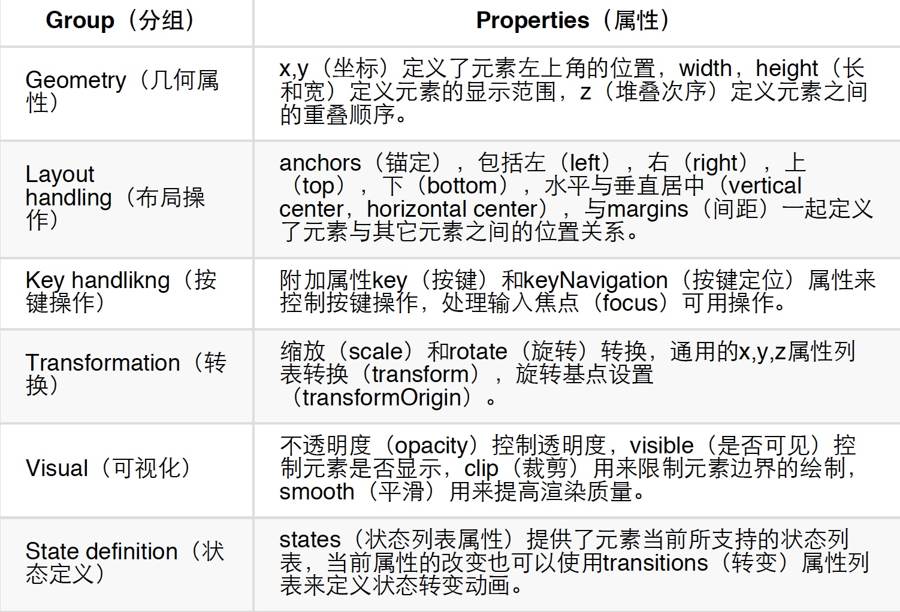
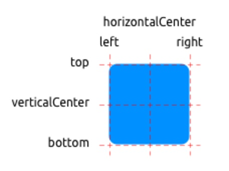

1、从QML元素的层次结构来理解是最简单的学习方式。子元素从父元素上继承了坐标系统，它的x,y坐标总是相对应于它的父元素坐标系统。

2、import声明导入了一个指定的模块版本。一般来说会导入QtQuick2.0来作为初始元素的引用。
1）使用//可以单行注释，使用/**/可以多行注释，就像C/C++和JavaScript一样。
2）每一个QML文件都需要一个根元素，就像HTML一样。
3）一个元素使用它的类型声明，然后使用{}进行包含。
4）元素拥有属性，他们按照name:value的格式来赋值。
5）任何在QML文档中的元素都可以使用它们的id进行访问（id是一个任意的标识符）。
6）元素可以嵌套，这意味着一个父元素可以拥有多个子元素。子元素可以通过访问parent关键字来访问它们的父元素。

<font color="#4590a3" size="2px">建议：
你会经常使用id或者关键字parent来访问你的父对象。有一个比较好的方法是命名你的根元素对象id为root（id:root），这样就不用去思考你的QML文档中的根元素应该用什么方式命名了。</font>

3、不同属性的特点：

1）id是一个非常特殊的属性值，它在一个QML文件中被用来引用元素。id不是一个字符串，而是一个标识符和QML语法的一部分。一个id在一个QML文档中是唯一的，并且不能被设置为其它值，也无法被查询（它的行为更像C++世界里的指针）。

2）一个属性能够依赖一个或多个其它的属性，这种操作称作属性绑定。当它依赖的属性改变时，它的值也会更新。这就像订了一个协议，在这个例子中height始终是width的两倍。

3）添加自己定义的属性需要使用property修饰符，然后跟上类型，名字和可选择的初始化值（property : ）。如果没有初始值将会给定一个系统初始值作为初始值。<font color="#4590a3" size="2px">注意：如果属性名与已定义的默认属性名不重复，使用default关键字你可以将一个属性定义为默认属性。这在你添加子元素时用得着，如果他们是可视化的元素，子元素会自动的添加默认属性的子类型链表（children property list）。</font>

4）另一个重要的声明属性的方法是使用alias关键字（property alias : ）。alias关键字允许我们转发一个属性或者转发一个属性对象自身到另一个作用域。我们将在后面定义组件导出内部属性或者引用根级元素id会使用到这个技术。一个属性别名不需要类型，它使用引用的属性类型或者对象类型。

5）text属性依赖于自定义的timers（int整型数据类型）属性。int整型数据会自动的转换为string字符串类型数据。这样的表达方式本身也是另一种属性绑定的例子，文本结果会在times属性每次改变时刷新。

6）一些属性是按组分配的属性。当一个属性需要结构化并且相关的属性需要联系在一起时，我们可以这样使用它。另一个组属性的编码方式是 font{family: "UBuntu"; pixelSize: 24 }。

7）一些属性是元素自身的附加属性。这样做是为了全局的相关元素在应用程序中只出现一次（例如键盘输入）。编码方式 。

8）对于每个元素你都可以提供一个信号操作。这个操作在属性值改变时被调用。例如这里我们完成了当height（高度）改变时会使用控制台输出一个信息。

<font color="#CD5C5C" size = "2px">警告:
一个元素id应该只在当前文档中被引用。QML提供了动态作用域的机制，后加载的文档会覆盖之前加载文档的元素id号，这样就可以引用已加载并且没有被覆盖的元素id，这有点类似创建全局变量。但不幸的是这样的代码阅读性很差。目前这个还没有办法解决这个问题，所以你使用这个机制的时候最好仔细一些甚至不要使用这种机制。如果你想向文档外提供元素的调用，你可以在根元素上使用属性导出的方式来提供。</font>

4、基础元素对象
Item（基础元素对象）是所有可视化元素的基础对象，所有其它的可视化元素都继承自Item。它自身不会有任何绘制操作，但是定义了所有可视化元素共有的属性。



（1）矩形框元素

```js
 Rectangle {
        id: rect1
        x: 12; y: 12
        width: 176; height: 96
        gradient: Gradient {
            GradientStop { position: 0.0; color: "lightsteelblue" }//渐变色
            GradientStop { position: 1.0; color: "slategray" }//渐变色
        }
        border.color: "slategray"
    }
```

一个渐变色是由一系列的梯度值定义的。每一个值定义了一个位置与颜色。位置标记了y轴上的位置（0 = 顶，1 = 底）。GradientStop（倾斜点）的颜色标记了颜色的位置。

<font color="#CD5C5C" size = "2px">注意：一个矩形框如果没有width/height（宽度与高度）将不可见。如果你有几个相互关联width/height（宽度与高度）的矩形框，在你组合逻辑中出了错后可能就会发生矩形框不可见，请注意这一点。</font>

（2）文本元素

```js
    Text {
        text: "The quick brown fox"
        color: "#303030"
        font.family: "Ubuntu"
        font.pixelSize: 28
    }
```

这个元素会使用给出的text（文本）与font（字体）来计算初始化的宽度与高度。
注意

<font color="#CD5C5C" size = "2px">注意：通常你想要对文本元素布局时，你需要区分文本在文本元素内部的边界对齐和由元素边界自动对齐。前一种情况你需要使用horizontalAlignment和verticalAlignment属性来完成，后一种情况你需要操作元素的几何形状或者使用anchors（锚定）来完成。</font>

（3）图像元素
图像元素（Image element）使用PreserveAspectCrop可以避免裁剪图像数据被渲染到图像边界外。默认情况下裁剪是被禁用的（clip:false）。你需要打开裁剪（clip:true）来约束边界矩形的绘制。这对任何可视化元素都是有效的。

（4）鼠标区域元素
为了与不同的元素交互，你通常需要使用MouseArea（鼠标区域）元素。这是一个矩形的非可视化元素对象，你可以通过它来捕捉鼠标事件。当用户与可视化端口交互时，mouseArea通常被用来与可视化元素对象一起执行命令

```js
Rectangle {
        id: rect1
        x: 12; y: 12
        width: 76; height: 96
        color: "lightsteelblue"
        MouseArea {
            id: area
            width: parent.width
            height: parent.height
            onClicked: rect2.visible = !rect2.visible
        }
    }

    Rectangle {
        id: rect2
        x: 112; y: 12
        width: 76; height: 96
        border.color: "lightsteelblue"
        border.width: 4
        radius: 8
    }
```

<font color="#CD5C5C" size = "2px">注意：这是QtQuick中非常重要的概念，输入处理与可视化显示分开。这样你的交互区域可以比你显示的区域大很多。</font>

5、组件
一个组件是一个可以重复使用的元素，QML提供几种不同的方法来创建组件。但是目前我们只对其中一种方法进行讲解：一个文件就是一个基础组件。一个以文件为基础的组件在文件中创建了一个QML元素，并且将文件以元素类型来命名（例如Button.qml）。你可以像任何其它的QtQuick模块中使用元素一样来使用这个组件。

通常我们命名根元素为root让引用更加方便。我们使用了QML的alias（别名）的功能，它可以将内部嵌套的QML元素的属性导出到外面使用。有一点很重要，只有根级目录的属性才能够被其它文件的组件访问。

<font color="#CD5C5C" size = "2px">注意：在调用时，可以设置覆盖属性，其他的都与组件设定相同。
就个人而言，可以更进一步的使用基础元素对象（Item）作为根元素。这样可以防止用户改变我们设计的按钮的颜色，并且可以提供出更多相关控制的API（应用程序接口）。我们的目标是导出一个最小的API（应用程序接口）。实际上我们可以将根矩形框（Rectangle）替换为一个基础元素（Item），然后将一个矩形框（Rectangle）嵌套在这个根元素（root item）就可以完成了。</font>

6、平移，旋转，缩放等转换
简单的位移是通过改变x,y坐标来完成的。旋转是改变rotation（旋转）属性来完成的，这个值使用角度作为单位（0~360）。缩放是通过改变scale（比例）的属性来完成的，小于1意味着缩小，大于1意味着放大。旋转与缩放不会改变对象的几何形状，对象的x,y（坐标）与width/height（宽/高）也类似。只有绘制指令是被转换的对象。

7、定位元素
有一些QML元素被用于放置元素对象，它们被称作定位器，QtQuick模块提供了Row，Column，Grid，Flow用来作为定位器。
通常Repeater（重复元素）与定位器一起使用。它的工作方式就像for循环与迭代器的模式一样。在这个最简单的例子中，仅仅提供了一个循环的例子。

8、布局元素
QML使用anchors（锚）对元素进行布局。anchoring（锚定）是基础元素对象的基本属性，可以被所有的可视化QML元素使用。



9、输入元素
1）文本输入（TextInput）：文本输入允许用户输入一行文本。这个元素支持使用正则表达式验证器来限制输入和输入掩码的模式设置。用户可以通过点击TextInput来改变焦点。为了支持键盘改变焦点，我们可以使用KeyNavigation（按键向导）这个附加属性。如TAB键切换输入框。

```js
    TextInput {
        id: input1
        x: 8; y: 8
        width: 96; height: 20
        focus: true
        text: "Text Input 1"
        KeyNavigation.tab: input2
    }

    TextInput {
        id: input2
        x: 8; y: 36
        width: 96; height: 20
        text: "Text Input 2"
        KeyNavigation.tab: input1
    }
```

2)焦点区域（FocusScope）：一个焦点区域（focus scope）定义了如果焦点区域接收到焦点，它的最后一个使用focus:true的子元素接收焦点，它将会把焦点传递给最后申请焦点的子元素。用于组件中，调用时候互相转移焦点。

```js
import QtQuick 2.0

FocusScope {
    width: 96; height: input.height + 8
    Rectangle {
        anchors.fill: parent
        color: "lightsteelblue"
        border.color: "gray"

    }

    property alias text: input.text
    property alias input: input

    TextInput {
        id: input
        anchors.fill: parent
        anchors.margins: 4
        focus: true
    }
}


main.qml中：
    Rectangle {
        ...
        TLineEditV2 {
            id: input1
            ...
        }
        TLineEditV2 {
            id: input2
            ...
        }
    }
```

3）文本编辑（TextEdit）：文本编辑（TextEdit）元素与文本输入（TextInput）非常类似，它支持多行文本编辑。它不再支持文本输入的限制，但是提供了已绘制文本的大小查询（paintedHeight，paintedWidth）。

4）按键元素（Key Element）：附加属性key允许你基于某个按键的点击来执行代码。例如使用up，down按键来移动一个方块，left，right按键来旋转一个元素，plus，minus按键来缩放一个元素。

```js
// keys.qml

import QtQuick 2.0

DarkSquare {
    width: 400; height: 200

    GreenSquare {
        id: square
        x: 8; y: 8
    }
    focus: true
    Keys.onLeftPressed: square.x -= 8
    Keys.onRightPressed: square.x += 8
    Keys.onUpPressed: square.y -= 8
    Keys.onDownPressed: square.y += 8
    Keys.onPressed: {
        switch(event.key) {
            case Qt.Key_Plus:
                square.scale += 0.2
                break;
            case Qt.Key_Minus:
                square.scale -= 0.2
                break;
        }

    }
}
```