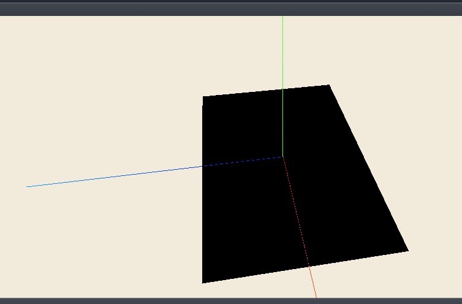

### 平台搭建：

建立本地服务器：python -m SimpleHTTPServer

### Emmet:

<http://docs.emmet.io/cheat-sheet/>

<https://github.com/paddingme/Learning-HTML-CSS/issues/17>

###总结：1）遇到新方法，查官方方法库，看参数表述。

 2）var sphereMaterial = new THREE.MeshLambertMaterial({color:0x7f77ff,wireframe:false});中wireframe表示用线框显示球

 3）构造一个运动的三维物体按以下几步进行：

a ）新建三大组件：

```coffee
var scene = new THREE.Scene();//场景，保存并跟踪渲染的物体
var camera = new THREE.PerspectiveCamera(45,window.innerWidth / window.innerHeight,0.1,1000);//定义了渲染好的scene看到什么
var renderer = new THREE.WebGLRenderer();//负责计算指定相机角度下浏览器中scene的样子

```

b ）定义camera的位置，并指向场景中心

c ) 新建三维图形：定义三维图形的尺寸，材质，合并到网格对象中，设置放置入场景的姿势，加入场景

d ) 新建灯光（用于投影）：设置位置，设置可投影光源属性(猜测以后可能有许多光源)，加入场景

e ）将renderer加入HTML中的div模块中：

```coffee
 $("#WebGL-output").append(renderer.domElement);
```

4）实现实时监控动画运行帧频：使用stats.js库

（帧频，即动画播放的速度，或时间轴上播放头滑动的距离，它是通过每秒中播放的帧数来衡量的。如果帧频太低，意味着你的动画不会太流畅；而帧频太高，又会影响动画的表现度，缩短了动画持续时间，或占用太多内容内存。动画的复杂性和电脑的运行速度都会影响动画播放的流畅性。在各种机器上测试你的动画来确定一个合适的帧频。）

 5) 实现动画效果：添加dat.GUI库，通过requestAnimationFrame函数反复内调更新。

 6）下图中绿色y轴 蓝色是z轴 红色是x轴用于调整照相机位置时候使用

 新建轴，数字为长短：var axes = new THREE.AxisHelper(60)

